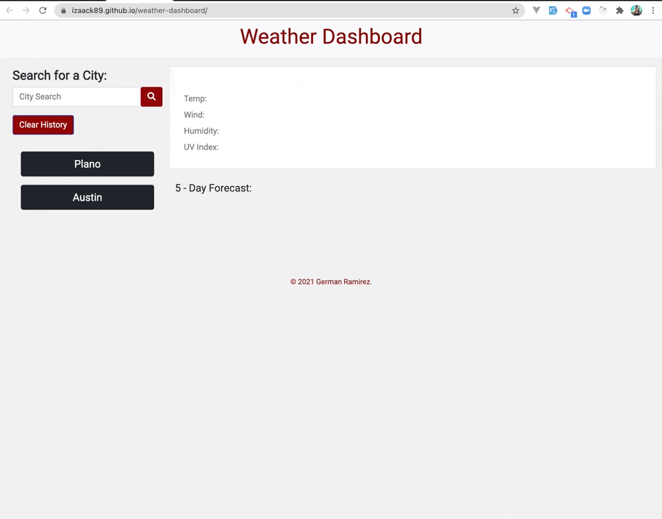
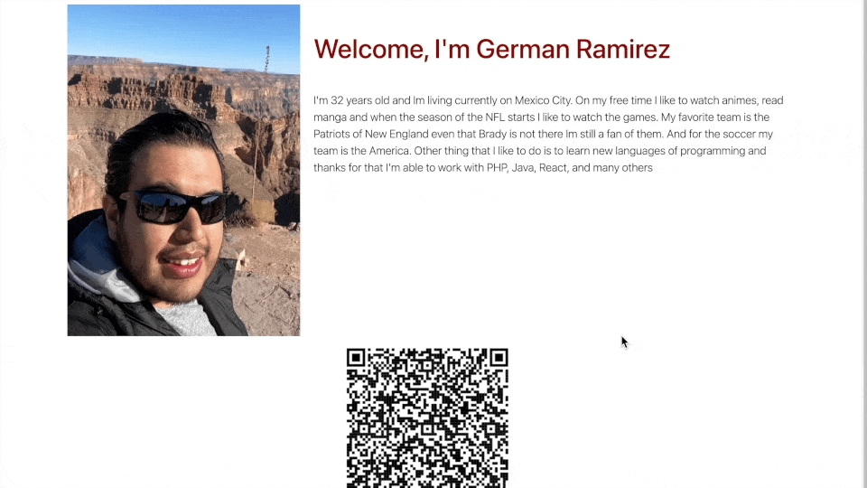

# Hi, I'm German Ramirez

I'm German from Mexico, and I'm a Software Developer. I really enjoy learning languages and frameworks like Laravel, React and VueJS, as well as work in environment like Linux and Windows. I also enjoy working with Databases like Mysql, Postgress, MongoDB, Oracle and SQL Server.

## Skills and Experience

- PHP
  - LARAVEL
  - ZEND
  - SYMFONY2
  - JOOMLA
  - WORDPRESS
- JAVA
- TABLEAU
- JAVASCRIPT
  - AJAX
  - JQUERY
  - ANGULAR
  - NODEJS
  - VUEJS
  - REACT
  - SEQUELIZE
  - HANDLEBARS
  - NODE
- WEB DESIGN
  - HTML5
  - CSS3
  - BOOTSTRAPT
  - MATERIALIZE
  - Flex
- DB
  - SQL SERVER
  - MYSQL
  - FIREBASE
  - POSTGRESS
  - MONGODB
  - REDIS
- Servers
  - Linux
  - Windows
  - AWS
- Version Control
  - CVS
  - SVN
  - GIT
  - GITLAB
  - Bitbucket

## Work Examples

- **PHP**

  - #### PropAnalysis System

- #### Tempus Portal System

On this programming language I have created full systems such as this example that is a "Property Analysis System" where the agent can enter an do an analysis of a property in order to have an idea about REHAB , OFFER , MAX OFFER , RENT/SALES COMPS. On the system "Tempus" is a portal for Investors where they aply to a Fund and the Fund Admin can obtain all the information necessary and notice the Investor if is approved or not.Using AJAX for Async data connection , API call to Docusign or Signow for documents sign and Mysql as main Database. Both Systems are protected with login system

- #### Ajax Backend Script
  
- #### PDF Export FPDF export
  

Also I have created script on PHP for print PDF, Excel , Word document that obtain the information from the DB. Another type of scripts are the ones that use API or SDK to connect with external system and retrieve data from them. Some API are I have been working are Zillow, Routetify, Quickbooks, Clio, Google, Facebook, among others

- **MYSQl**

Here I can show one of many schemas that I have creted on the past , with this I want to show that I know how to create relations between tables and also I can built for robust systems such as this example that represent a system for audits

## Repositorie Examples

[Sport Almanac Repo](https://github.com/adina-hc/sports-almanac) |
[Sport Almanac Live](https://adina-hc.github.io/sports-almanac/)  

[Code BaseRepo](https://github.com/izaack89/code-base) |
[Code Base Live](https://izaack89.github.io/code-base/)

[Day Planner Repo](https://github.com/izaack89/day-planner) |
[Day Planner Live](https://izaack89.github.io/day-planner/)

[Weather Dashboard Repo](https://github.com/izaack89/weather-dashboard) |
[Weather Dashboard Live](https://izaack89.github.io/weather-dashboard/)

[School System Repo](https://github.com/izaack89/school-system) |
[School System Live](https://infinite-chamber-84516.herokuapp.com/)

[Tech Blog Repo](https://github.com/izaack89/tech-blog) |
[Tech Blog Live](https://floating-garden-59968.herokuapp.com/login)

## Portfolio Built With

- [Font Awesome](https://fontawesome.com/v5.15/how-to-use/on-the-web/using-with/react) - Vector icons and social logos
- [Favico Generator](https://www.favicon-generator.org/) - Roboto font
- For More Info please visit the follow links [GitHub Portfolio](https://github.com/izaack89/portfolio) - [Portfolio Site](https://izaack89.github.io/portfolio/)
- [Data Load](https://www.pluralsight.com/guides/load-and-render-json-data-into-react-components) - Data Load
- [Axios & PHP](https://blog.bitsrc.io/how-to-build-a-contact-form-with-react-js-and-php-d5977c17fec0) - Use Axios and PHP to send emails
- [Buttons Disable](https://stackoverflow.com/questions/41488715/how-to-disable-button-in-react-js) - Disable Buttons
- [SVG Images](https://undraw.co/search) - SVG Images
- [Bootstrap](https://getbootstrap.com/docs/5.0/) - Bootsrap Documentation
- [Navbar React](https://stackoverflow.com/questions/66217242/collapsed-navbar-not-working-react-and-bootstrap-5) Navbar issues with React

## [Portfolio GitHub Code](https://github.com/izaack89/portfolio-react/settings/pages)

## [Portfolio Live](https://izaack89.github.io/portfolio-react/)

## Author

- **German Ramirez** - [GitHub](https://github.com/izaack89/)
- **German Ramirez CV** - [CV](https://izaack89.github.io/portfolio-react/assets/pdf/CV-German_Isaac_Ramirez.pdf)

